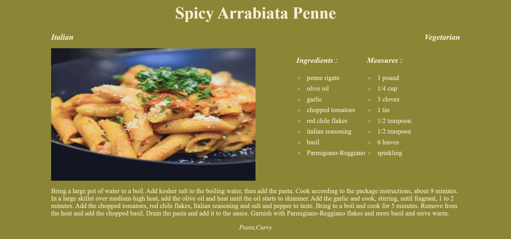

# recipe app react

[](https://github.com/prettier/prettier)



## Getting started

To start the service run:

```
npm install
npm start
```

## License

This project is licensed under the MIT License- see the [LICENSE](LICENSE) file for details.
